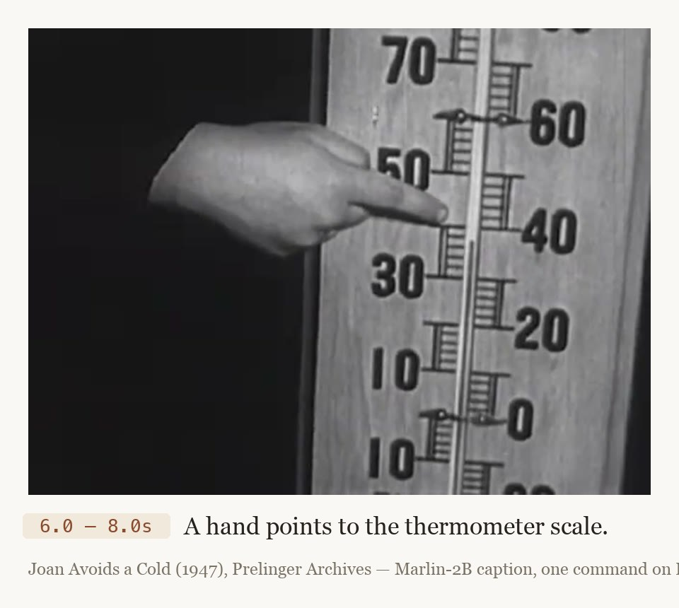

# Video

Scripts for captioning and temporally grounding video files using HF Buckets and Jobs.

What the output looks like — a frame from *Joan Avoids a Cold* (1947, Prelinger Archives) with the event Marlin-2B produced for that moment:



## Quick Start

Scripts run directly from their Hub URL — no clone or local checkout needed:

```bash
# Caption every video in a bucket: dense scene captions + timestamped events
hf jobs uv run --image vllm/vllm-openai:latest --flavor a10g-small \
    -s HF_TOKEN \
    -v hf://buckets/user/my-videos:/input:ro \
    https://huggingface.co/datasets/uv-scripts/video/raw/main/marlin-caption.py \
    /input hf://buckets/user/my-videos/captions

# Temporal grounding: when does an event happen?
hf jobs uv run --image vllm/vllm-openai:latest --flavor a10g-small \
    -s HF_TOKEN \
    -v hf://buckets/user/my-videos:/input:ro \
    https://huggingface.co/datasets/uv-scripts/video/raw/main/marlin-caption.py \
    /input hf://buckets/user/out --find "a person enters the room"
```

## Scripts

### qwen38-caption.py

Runs [Qwen/Qwen3.8-27B](https://huggingface.co/Qwen/Qwen3.8-27B) (27B dense VLM,
Apache 2.0, not gated) over a directory of videos via vLLM — **whole videos, no
chunking**. The model ingests video natively at hour scale: an 11-minute film is
one request. Output is a resumable parquet dataset, one row per video with
`caption` (and, with `--timestamps`, an `events` column of `<start - end>`
descriptions in global seconds).

`--timestamps` asks for a full event timeline instead of a prose caption. The
model reads times off per-frame time tags rather than estimating, so timestamps
are accurate to the frame-sampling interval (~2s at the default `--fps 2`;
verified against extracted frames on an 11-minute film — 96 events, on-screen
text quoted verbatim).

Thinking mode is off by default; `--thinking` re-enables it with the model
card's thinking sampling params and a larger token budget.

**Hardware**: bf16 weights are ~52 GB — `a100-large` minimum; `h200` generates
~2.3x faster.

**vs marlin-caption.py**: Marlin is ~13x smaller and cheaper per minute of
footage, but must chunk at 60s (with per-chunk timestamp offsetting) and returns
grounding candidates rather than reliable timelines. Qwen3.8 handles the whole
film in one pass with verbatim on-screen-text reading. Rough guide: bulk
captioning of large collections → Marlin; rich timelines, text-heavy or
long-form material → Qwen3.8.

### marlin-caption.py

Runs [NemoStation/Marlin-2B](https://huggingface.co/NemoStation/Marlin-2B) (2B video
VLM, gated — accept the license on the model page first) over a directory of videos
via vLLM. Output is a resumable parquet dataset: one row per ~60s chunk with `scene`,
`caption`, and an `events` column of `<start - end>` descriptions in seconds.
Re-running skips completed rows; failed rows are recorded, not dropped
(`--retry-errors` re-attempts them).

Videos longer than ~60s are split into chunks and event timestamps offset back to
global film time. This is required for correct timestamps, not an optimisation:
Marlin was trained on short clips and compresses any input onto a ~60s timeline.

`--find "event"` switches to grounding mode: each chunk returns a candidate
`(span_start, span_end)`. Spans are candidates, not detections — the model cannot
say "not present", so filter or verify downstream. When the event is real, spans
are precise to fractions of a second.

**Cost**: ~3s of GPU per minute of film on `a10g-small` at batch scale — about
$0.05 per hour of footage.

**Memory**: defaults encode a measured config (`--mm-processor-cache-gb 0`, in-flight
window capped at 24). vLLM's multimodal cache grows without bound on distinct videos
and will OOM a 15 GB node if re-enabled. On `a10g-large` and up, `--window-max 64`
is safe.

Run `--help` on the script for all options.
